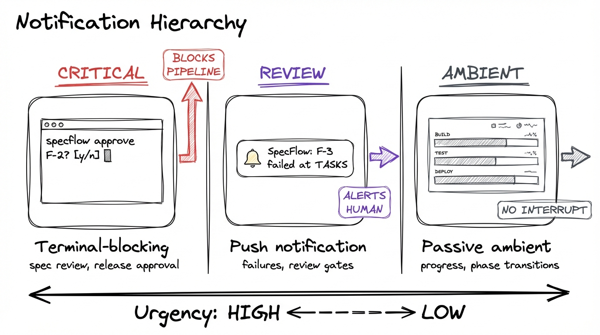
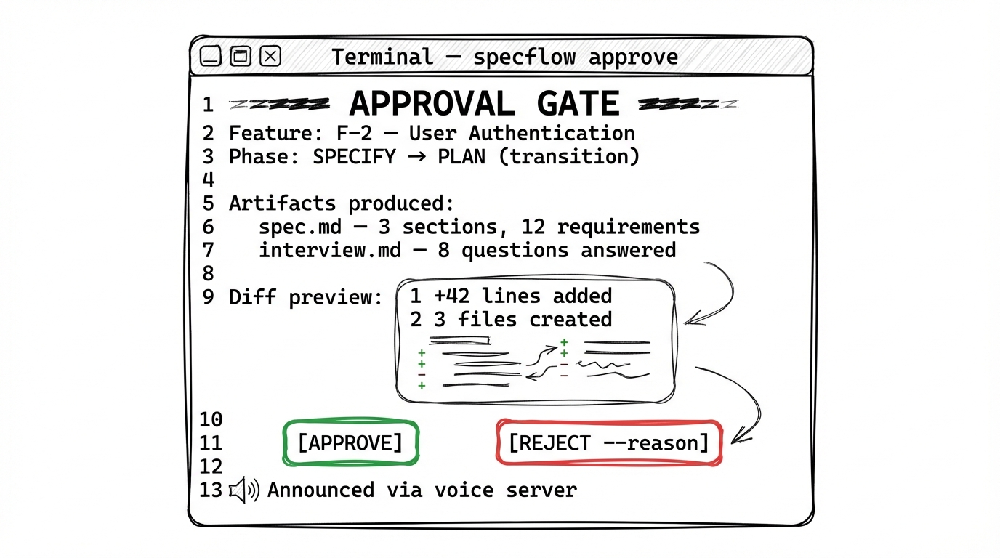
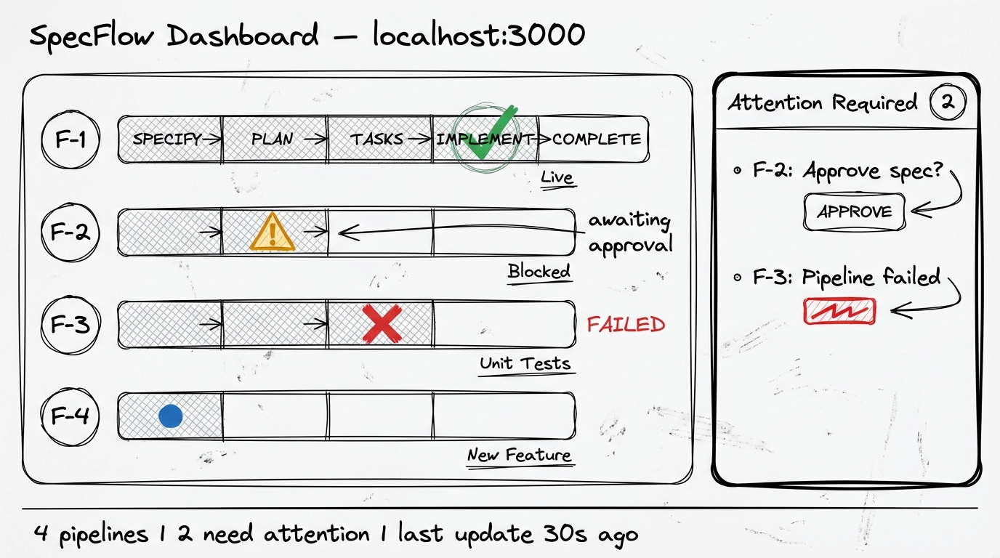

# SpecFlow UX & Orchestration Research — Human-in-the-Loop for Autonomous Pipelines

**Date:** 2026-02-02
**Author:** @mellanon (agent: Luna)
**Project:** specflow-lifecycle (pai-collab) / specflow-bundle (feature/lifecycle-extension)
**Status:** Research complete, informing F-11 through F-15 feature design

---

## 1. Executive Summary

SpecFlow's headless pipeline runs autonomously but provides zero visibility to the human operator. This research examines how to add human-in-the-loop (HITL) patterns without turning SpecFlow into a monitoring tool.

**Sources analyzed:**
- [BloopAI/vibe-kanban](https://github.com/BloopAI/vibe-kanban) — Rust/TypeScript task orchestration platform for AI coding agents
- [pai-collab #78](https://github.com/mellanon/pai-collab/issues/78) — Local blackboard proposal for agent coordination
- PAI Observability Server (port 4000) — existing WebSocket event streaming with task watcher
- Council debate with UX Designer, Architect, Engineer, and Operator personas

**Key finding:** The current features.json (F-1 through F-10) is entirely Layer 2 (tooling) and Layer 3 (process). **Layer 4 — orchestration — has zero coverage.** Five new features (F-11 through F-15) are proposed to address this gap.

---

## 2. The Problem (Observed in Dogfooding)

During a live dogfooding session on 2026-02-02, the operator kicked off `specflow pipeline F-1` in one terminal and switched to other work. Three problems emerged:

1. **Zero visibility** — No way to see what phase the pipeline was in without manually `tail`-ing output files
2. **Silent failure** — The IMPLEMENT phase crashed because `docs.md` and `verify.md` didn't exist in headless mode. The operator discovered this 20 minutes later.
3. **No inter-session awareness** — A second agent session running concurrently had no idea the first pipeline was stuck

These are not edge cases. They are the default experience of autonomous pipeline execution.

---

## 3. Vibe-Kanban: What We Learned

Vibe-kanban (BloopAI) is a task orchestration platform implementing **exception-based human attention** — agents work autonomously, humans only intervene when needed.

### Architecture

```
Project → Task → Workspace (git worktree) → Session (conversation) → ExecutionProcess (agent run)
```

### Key Patterns Extracted

| Pattern | How Vibe-Kanban Does It | SpecFlow Relevance |
|---------|------------------------|-------------------|
| **InReview state** | Task auto-transitions when agent finishes | Add REVIEW phase with auto-transition |
| **Approval service** | PendingApproval with configurable timeout | Approval gates at phase boundaries |
| **Notification service** | Cross-platform: osascript (macOS), notify-rust (Linux), PowerShell (Windows) + sound | Phase transition notifications |
| **Progress broadcasting** | WebSocket streams of real-time execution state | Progress file for inter-session visibility |
| **Execution tracking** | Every agent run logged with before/after git SHAs | Execution audit log in SQLite |
| **Failure → InReview** | Failure auto-transitions to review (not terminal) | Graceful degradation + resume |

### What We Should NOT Adopt

| Pattern | Why Not for SpecFlow |
|---------|---------------------|
| Git worktree per task | Single-agent model; revisit for multi-agent blackboard |
| WebSocket streaming | Over-engineered for CLI; file-based polling is sufficient |
| Multi-agent support | Council verdict: maintain Claude-only trust boundary |
| Web dashboard | specflow-ui already exists at localhost:3000 |

---

## 4. Five HITL Primitives

Decomposing vibe-kanban's human attention model to first principles:

| Primitive | What | Current SpecFlow Coverage |
|-----------|------|--------------------------|
| **VISIBILITY** | What is happening right now? | None |
| **NOTIFICATION** | Something needs your attention | None |
| **APPROVAL** | Agent needs permission to proceed | None |
| **REVIEW** | Agent finished, human validates | F-6/7/8 (partially) |
| **RECOVERY** | Something failed, agent needs help | None |

---

## 5. Council Debate: UX Design

A 3-round council debate (UX Designer, Architect, Engineer, Operator) produced consensus on the interaction model.

### The Three Interaction Modes



| Mode | When | UI Surface | Example |
|------|------|-----------|---------|
| **Terminal-blocking** | Human judgment required NOW | CLI prompt | `specflow approve F-2? [y/n]` |
| **Push notification** | Human should look soon | Desktop alert + voice | "SpecFlow: F-3 failed at TASKS" |
| **Passive ambient** | Human might want to know | Dashboard / status file | Progress bars on localhost:3000 |

### Council Convergence (4/4 agreed)

- **Structured JSON protocol** over exit codes — urgency tier, context, gate type in output
- **Push critical, pull routine** — failures/reviews/releases interrupt; progress is queryable
- **Annotation-driven gates** — `@human-review` in spec files declares urgency tier
- **Operator controls urgency** — spec author declares what's blocking vs. ambient
- **Trust model: start noisy, earn silence** — push critical+review in v1, operator tunes down

### Remaining Disagreements

- **Decorators vs explicit conditionals** — compromise: declarative config, explicit execution
- **Silent-by-default vs push-first** — operator wins for v1: earn trust with visibility first

---

## 6. Proposed Features (F-11 through F-15)

### F-11: Pipeline Progress File (VISIBILITY)

```json
{
  "id": "F-11",
  "name": "Pipeline progress file — inter-session visibility",
  "description": "During headless pipeline execution, write a machine-readable progress file (.specify/pipeline/progress.json) updated at each phase transition. Contains: current phase, feature ID, start time, phase durations, artifacts produced, errors encountered. Other sessions can tail this file for real-time monitoring. Includes a specflow status --watch command that polls progress.json and renders a live dashboard.",
  "priority": 2
}
```

### F-12: Phase Transition Notifications (NOTIFICATION)

```json
{
  "id": "F-12",
  "name": "Phase transition notifications — multi-channel alerts",
  "description": "At each phase transition, emit a notification via configurable backend: macOS osascript, PAI voice server (curl to localhost:8888), PAI observability server (WebSocket to localhost:4000), or custom webhook. Notifications include: feature ID, completed phase, next phase, urgency tier. On failure, emit urgent notification. Configurable in .specflow/config.yaml: notification_backend, notify_on settings. Three urgency tiers: critical (voice+desktop), review (desktop), ambient (log only).",
  "priority": 2
}
```

### F-13: Approval Gates at Phase Boundaries (APPROVAL)



```json
{
  "id": "F-13",
  "name": "Approval gates — annotation-driven HITL phase transitions",
  "description": "Configurable approval gates at any phase boundary. Spec authors annotate urgency: @interrupt:critical (terminal-blocking), @interrupt:review (push alert), @interrupt:ambient (log only). Pipeline pauses at critical gates, writes structured JSON to .specify/pipeline/pending-approval.json, emits notification, waits for specflow approve F-N or specflow reject F-N --reason. Timeout configurable per gate.",
  "dependencies": ["F-12"],
  "priority": 3
}
```

### F-14: Pipeline Failure Recovery (RECOVERY)

```json
{
  "id": "F-14",
  "name": "Pipeline failure recovery — graceful degradation and resume",
  "description": "When a headless pipeline phase fails: (1) capture error context to .specify/pipeline/failure.json, (2) emit urgent notification, (3) set feature status to blocked (recoverable, not terminal), (4) skip missing optional artifacts (docs.md, verify.md) with warning rather than hard fail. New specflow pipeline resume F-N command. Artifact requirements configurable: required vs optional per phase.",
  "priority": 2
}
```

### F-15: Execution Audit Log (AUDIT)

```json
{
  "id": "F-15",
  "name": "Execution audit log — phase-level tracking in SQLite",
  "description": "New execution_log table in features.db: feature_id, phase, started_at, completed_at, duration_seconds, status (success|failed|skipped), git_sha_before, git_sha_after, artifacts_produced (JSON array), error_message. Every phase execution writes a row. specflow log F-N shows execution history. Rollback capability via git_sha_before.",
  "dependencies": ["F-1"],
  "priority": 3
}
```

---

## 7. The Dashboard Question: CLI vs Web UI

### Where Each Surface Wins

| Mode | CLI | Web UI (specflow-ui) |
|------|-----|---------------------|
| Terminal-blocking (approve/reject) | Perfect fit | Adds nothing |
| Push notifications (alerts) | Perfect fit (osascript/voice) | Adds nothing |
| **Multi-session monitoring** | **Marginal** — one pipeline at a time | **This is where it shines** |

### The Dashboard Wireframe



The specflow-ui (localhost:3000) already exists as a Bun web server. The enhancement needed:

1. **Pipeline status panel** — all running/paused/failed pipelines from `progress.json` (F-11)
2. **Approval queue** — pending approvals with one-click approve/reject (F-13)
3. **Failure feed** — recent failures with error context (F-14)
4. **Phase timeline** — visual progression from execution log (F-15)

**Architecture: read-only dashboard consuming existing data.** No new server, no new state — just a visual lens on the files and SQLite that the CLI already writes.

### Layered UI Architecture

```
CLI (specflow status, specflow approve)
 |  For: single-feature commands, approvals
 |
 |-- Voice/Desktop Notifications (localhost:8888)
 |   For: "come look at this" interrupts
 |
 |-- specflow-ui Dashboard (localhost:3000)
 |   For: "what's happening across everything?"
 |
 |-- PAI Observability Server (localhost:4000)
     For: traces, hook events, cross-session correlation
```

---

## 8. Observability Integration

PAI already has an observability server at port 4000 with:

- **WebSocket streaming** to connected clients
- **File-based ingestion** from `~/.claude/projects/`
- **Task watcher** for background agent monitoring
- **React dashboard** client app

### How This Connects

The observability server could consume SpecFlow's `progress.json` and `execution_log` as another data source:

| Data Source | What It Provides | Integration |
|-------------|-----------------|-------------|
| `progress.json` (F-11) | Real-time pipeline state | File watcher ingests phase transitions |
| `execution_log` (F-15) | Phase-level audit trail | SQLite query for historical view |
| `pending-approval.json` (F-13) | Approval queue | File watcher triggers WebSocket alert |
| `failure.json` (F-14) | Error context | File watcher triggers urgent notification |

This means the PAI observability dashboard could show SpecFlow pipeline state alongside hook traces and agent activity — a **unified view of all autonomous work**.

### Hooks as Instrumentation

PAI hooks already fire on tool use events. SpecFlow could emit custom hook events at phase boundaries:

```
PhaseStarted { feature: "F-1", phase: "IMPLEMENT", timestamp }
PhaseCompleted { feature: "F-1", phase: "IMPLEMENT", duration: 120s, artifacts: [...] }
ApprovalRequired { feature: "F-2", gate: "spec_review", urgency: "critical" }
PhaseFailed { feature: "F-3", phase: "TASKS", error: "docs.md not found" }
```

These events flow through the existing observability pipeline — file ingestion → WebSocket broadcast → dashboard render.

---

## 9. Connection to Local Blackboard (#78)

The local blackboard proposal (pai-collab #78) and these SpecFlow features solve the same problem at different layers:

| Layer | What | Tool |
|-------|------|------|
| **Agent coordination** | Who is working on what, token quotas | Blackboard #78 |
| **Pipeline orchestration** | Phase state, approvals, failures | SpecFlow F-11-15 |
| **Cross-session visibility** | What's happening across all sessions | Observability server |

**Gaps in #78 that vibe-kanban fills:**
- Blackboard #78 has no **notification mechanism** — F-12 provides one
- Blackboard #78 has no **approval protocol** — F-13 provides one
- Vibe-kanban's **timeout pattern** should inform blackboard's stale detection

---

## 10. Priority & Implementation Order

| Priority | Feature | Why This Order |
|----------|---------|---------------|
| **P2 (now)** | F-14 Failure recovery | Immediate pain — pipeline crashes on optional artifacts |
| **P2 (now)** | F-11 Progress file | Immediate pain — zero visibility into headless runs |
| **P2 (next)** | F-12 Notifications | Enables exception-based attention |
| **P3** | F-13 Approval gates | Depends on F-12; most valuable for review + release |
| **P3** | F-15 Execution log | Depends on F-1 schema; enables rollback + audit |

---

## Appendix A: Companion Documents

| Document | Location | Content |
|----------|----------|---------|
| Vibe-Kanban Orchestration Analysis | `research/2026-02-02-vibe-kanban-orchestration-analysis.md` | Full vibe-kanban architecture analysis and concept mapping |
| Council Debate: SpecFlow UX HITL | `research/2026-02-02-council-debate-specflow-ux-hitl.md` | 3-round debate transcript with UX, Architect, Engineer, Operator |
| Spec-Driven Dev Landscape | `research/2026-02-02-spec-driven-dev-landscape.md` | Four-layer architecture, ecosystem map, council verdict C+ |
| Council Debate: SpecFlow vs OpenSpec | `research/2026-02-02-council-debate-specflow-vs-openspec.md` | Greenfield vs brownfield tooling decision |
| OpenSpec Deep Dive | `research/2026-02-02-openspec-deep-dive.md` | Full OpenSpec v1.1.1 analysis |

## Appendix B: Wireframe Assets

| File | Shows |
|------|-------|
| `assets/wireframe-dashboard.png` | Pipeline status dashboard with attention panel |
| `assets/wireframe-approval-gate.png` | CLI approval gate interaction |
| `assets/wireframe-notification-hierarchy.png` | Three-tier notification model |
